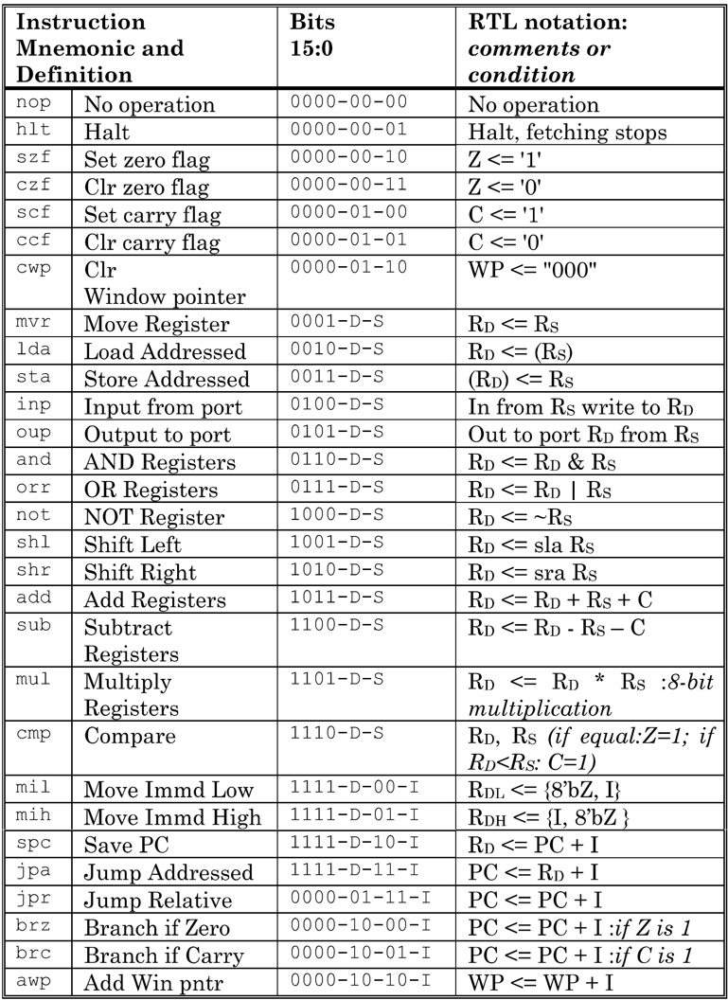

[SAYEH Compiler](https://github.com/aminrashidbeigi/SAYEH-Compiler.git)
=
SAYEH Compiler is a C compiler that generates assembly codes for [SAYEH](https://github.com/aminrashidbeigi/SAYEH.git) Basic Computer.

Parts
-

- Lexical Analyzer
- Syntax Analyzer
- Semantic Analyzer
- Code Generator

Assembly Codes
-

  

